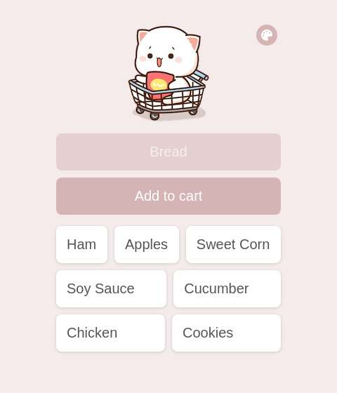

# JS-AddToCartMobileApp
Add To Card Mobile App using JS and Firebase
<a href="https://issakass.github.io/JS-AddToCartMobileApp/">↪ Live Demo </a>  

## About the App
- This app is from Scrimba JS Tutorial (thanks for them).
- It is built in HTML, CSS and JavaScript.
- It uses Firebase as a database.

## Download the App
### On Android
- Click the following link on your android mobile: <a href="https://add-to-cart-issakass.netlify.app/">https://add-to-cart-issakass.netlify.app</a>
- On the top right corner, click the menu button <b>⁝</b>
- From the menu list, click on <b>Add To Home</b>
- Set the display name or leave it.
- Press the <b>Add</b> button.
- You should find the app in your mobile.

### On ios
- Click the following link on your ios mobile: <a href="https://add-to-cart-issakass.netlify.app/">https://add-to-cart-issakass.netlify.app</a>
- On the bottom panel, click the button in the center<b></b>
- From the menu list, click <b>Add To Home Screen</b>
- Set the display name or leave it.
- Press the <b>add</b> button.
- You should find the app in your mobile.
